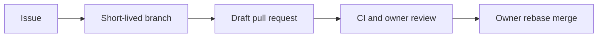

# Process Scaffold Baseline

## Goal
Establish the owner-reviewed workflow controls needed before the MiniShop implementation is split into pull requests.

## Prerequisites
- Public GitHub repository with the owner-administered `Protect main` ruleset.
- [Git workflow](../process/git-workflow.md) for contributor behavior.

## Key Concepts
| Concept | Plain-language explanation |
|---|---|
| README-only exception | The owner approved retaining the original README-only initial commit instead of rewriting `main` history. |
| Sanitized backup | The public safety branch omits one vendor manifest blocked for a hardcoded PostgreSQL password. |
| T2 work | Higher-risk work that needs a devlog, ADR, owner scope sign-off, and independent review. |

## Architecture / Flow
The owner protects `main`; contributors work from an Issue on a short-lived branch and leave a Draft PR for owner review.



## Implementation Walkthrough
1. **Protect the public repository**: the owner configured `main` to require a pull request, one approval, code-owner review, resolved conversations, linear history, and the strict `ci` check.
   - File(s): GitHub repository settings
   - Only rebase merging is enabled; force pushes and branch deletion are blocked.
2. **Record the history exception**: the owner approved preserving the original README-only commit.
   - File(s): this ADR
   - No history rewrite is performed.
3. **Use a sanitized safety branch**: `backup/initial-generation` preserves 65 generated files locally and remotely.
   - File(s): `backup/initial-generation`
   - `vendor/kuma-demo/kuma-demo-aio.yaml` remains excluded from the public branch after publication was blocked for a hardcoded PostgreSQL password.

## Run & Verify
```bash
git ls-tree -r --name-only backup/initial-generation | wc -l
git log --oneline backup/initial-generation
```
Expected result: the local backup branch reports 65 files and corresponds to the sanitized remote baseline.

The process scaffold’s local validation passed: YAML syntax, staged-diff whitespace, `AGENTS.md` size, Codex Git rules, and Gitleaks. `yamllint` was not run locally because `python3-venv` was unavailable; CI installs and runs it.

## Common Pitfalls
- **Symptom**: a pull request cannot satisfy the `ci` requirement. Cause: the workflow has not run against the branch. Fix: wait for the `ci` job and address its reported failure.
- **Symptom**: an exact generated-tree backup cannot be published. Cause: the excluded vendor manifest contains a hardcoded password. Fix: use the approved sanitized backup and do not publish the excluded file.

## Try It Yourself
- Open a Draft PR changing a protected path and confirm that `ci` and owner review are required before merge.

## Further Reading
- [GitHub rulesets documentation](https://docs.github.com/en/repositories/configuring-branches-and-merges-in-your-repository/managing-rulesets/about-rulesets)

## Related Docs
- Previous: N/A
- Next: [Git workflow](../process/git-workflow.md)
