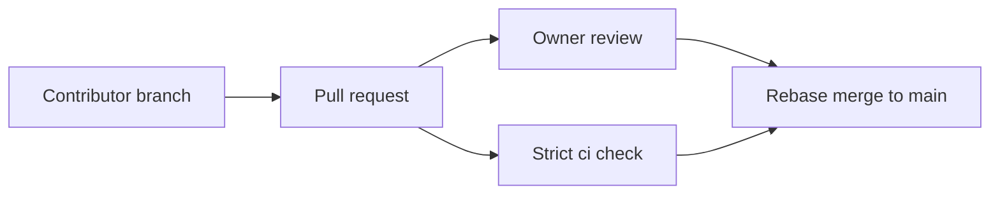

# Public Repository Protection Baseline

## Goal
Record the approved public-repository workflow baseline without rewriting the existing history. This preserves the owner-reviewed pull-request workflow while keeping Phase 0 prerequisites visible.

## Prerequisites
- A public GitHub repository administered by the human owner.
- The active `Protect main` ruleset, ID `23990460`, targeting `main`.
- Phase 1 must create the required `ci` workflow job and `.github/CODEOWNERS` before the remaining ruleset behavior can be exercised.

## Key Concepts
| Concept | Plain-language explanation |
|---|---|
| Ruleset | GitHub enforcement applied to `main`, independent of local agent instructions. |
| Strict `ci` check | A required check that must run against the current target branch before a pull request can merge. |
| README-only exception | The owner approved retaining the original README-only initial commit rather than rewriting `main` history to add other initial files. |

## Architecture / Flow
The owner administers protections on the public repository. Contributors propose changes through pull requests; the `Protect main` ruleset requires review and the `ci` check before merge.



## Implementation Walkthrough
1. **Retain initial history**: the owner approved a GH-01 exception for the README-only initial commit.
   - File(s): `docs/decisions/0002-public-repository-protection.md`
   - No history rewrite is performed.
2. **Protect `main`**: the owner configured the active `Protect main` ruleset with no bypasses.
   - File(s): GitHub repository settings
   - It requires pull requests, one approval, code-owner review, resolved conversations, linear history, and the strict `ci` check; force pushes and branch deletion are disallowed.
3. **Limit merge behavior**: the repository allows rebase merging only and automatically deletes merged head branches.
   - File(s): GitHub repository settings
   - This keeps the intended linear, short-lived branch workflow.
4. **Launch the GitHub MCP server**: the pinned official server starts with the GitHub App installation, exposes only the `repos`, `issues`, `pull_requests`, and `actions` toolsets, and does not expose deployments.
   - File(s): user-level Codex MCP configuration
   - MCP initialization and tool discovery passed. A temporary read-only repository-root request returned `README.md`, confirming App-backed repository access without forwarding the owner credential.

## Run & Verify
```bash
gh api repos/thanhdu-hcmus/minishop-k8s/rulesets/23990460
gh api repos/thanhdu-hcmus/minishop-k8s --jq '.allow_rebase_merge, .allow_squash_merge, .allow_merge_commit, .delete_branch_on_merge'
```
Expected result: the `Protect main` ruleset targets `main`, has no bypasses, and exposes the documented review, history, and branch-protection settings.

The GitHub MCP launch, authentication, restricted-toolset check, and read-only repository smoke test are verified. A normal Codex session restart is still needed before its tool catalog can be checked from `/mcp`; its write path and draft-PR smoke test remain unverified. The direct-push and merge-commit rejection tests are pending Phase 1 because the required `ci` job and `.github/CODEOWNERS` do not yet exist.

## Common Pitfalls
- **Symptom**: pull requests cannot satisfy the required `ci` check. Cause: Phase 1 has not created a job named exactly `ci`. Fix: add that job before opening workflow-enforced pull requests.
- **Symptom**: code-owner review cannot be evaluated. Cause: `.github/CODEOWNERS` is absent. Fix: add it in Phase 1 before testing the ruleset requirement.

## Try It Yourself
- After Phase 1, open a draft pull request that changes a protected path and confirm that `ci` and code-owner review are both required before it can merge.

## Further Reading
- [GitHub rulesets documentation](https://docs.github.com/en/repositories/configuring-branches-and-merges-in-your-repository/managing-rulesets/about-rulesets)

## Related Docs
- Previous: [Repository delivery decision](./0001_repository_only_delivery.md)
- Next: N/A
