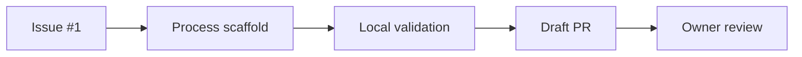

# Process Scaffold Delivery Record

## Goal
Create the repository controls that govern later MiniShop delivery slices and record the approved public backup exception.

## Prerequisites
- [Issue #1](https://github.com/thanhdu-hcmus/minishop-k8s/issues/1).
- Owner-approved process sequence and public-repository ruleset.

## Key Concepts
| Concept | Plain-language explanation |
|---|---|
| Process scaffold | The CI, contribution templates, local agent guidance, and workflow rules for later changes. |
| Sanitized backup | A public baseline that omits a manifest containing a hardcoded password. |

## Architecture / Flow
The scaffold connects an Issue, local branch rules, CI, a devlog, and the owner’s review before a change reaches `main`.



## Implementation Walkthrough
1. **Add delivery controls**: Issue and PR templates, `CODEOWNERS`, a `ci` workflow, agent profiles, agent skills, Git execution rules, and root guidance were added.
   - File(s): `.github/`, `.codex/`, `.agents/`, `AGENTS.md`
   - The workflow’s required job is named `ci` and checks commits, guidance size, YAML, devlog presence, and secrets.
2. **Document contributor flow**: the Git workflow defines Issue-to-branch-to-Draft-PR delivery and T0/T1/T2 requirements.
   - File(s): `docs/process/git-workflow.md`
   - The owner reviews and rebase-merges; agents do not merge.
3. **Record backup remediation**: the sanitized backup branch excludes the vendor manifest blocked for a hardcoded PostgreSQL password.
   - File(s): [process scaffold ADR](../decisions/0001-process-scaffold-baseline.md)
   - The source manifest was not changed; the documented sanitized branch has 65 matching local and remote files.

## Run & Verify
```bash
git diff --cached --check
git diff --check
```
Expected result: no whitespace errors.

Draft PR #2 is published. The Conventional Commit check now lints the actual pull-request head range, with a self-contained rule configuration; the push range remains separate. PyYAML, the scaffold commit-lint check, and `git diff --check` passed locally. CI run `36165218460`, job `108171191576`, completed successfully. Four earlier runs failed during scaffold correction: `36162971908` before a job started, `36164296860` on commitlint, and `36164680817` plus `36164996441` on yamllint. GitHub-ruleset enforcement remains unverified. The required T2 independent reviewer findings are also pending before the PR can be ready.

## Common Pitfalls
- **Symptom**: local YAML linting is unavailable. Cause: the environment lacks `python3-venv`. Fix: rely on the pinned CI check until the environment is provisioned.
- **Symptom**: backup publication is blocked. Cause: the excluded vendor manifest contains a hardcoded PostgreSQL password. Fix: preserve the approved 65-file sanitized baseline and keep the file out of public history.

## Try It Yourself
- Create a non-trivial Draft PR without a `docs/devlog/` entry and observe the CI devlog requirement fail.

## Further Reading
- [Git workflow](../process/git-workflow.md)
- [Process scaffold baseline](../decisions/0001-process-scaffold-baseline.md)

## Related Docs
- Previous: [Process scaffold baseline](../decisions/0001-process-scaffold-baseline.md)
- Next: N/A
