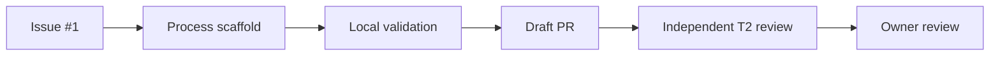

# Process Scaffold Delivery Record

## Goal
Create the repository controls that govern later MiniShop delivery slices and record the approved public backup exception.

## Prerequisites
- [Issue #1](https://github.com/thanhdu-hcmus/minishop-k8s/issues/1).
- Owner-approved process sequence and public-repository ruleset.

## Key Concepts
| Concept | Plain-language explanation |
|---|---|
| Process scaffold | The CI, contribution templates, local agent guidance, and workflow rules for later changes. |
| Sanitized backup | A public baseline that omits a manifest containing a hardcoded password. |
| T2 review | An independent review of a significant change before it is ready for merge. |

## Architecture / Flow
The scaffold connects an Issue, local branch rules, CI, a devlog, and the owner’s review before a change reaches `main`.



## Implementation Walkthrough
1. **Add delivery controls**: Issue and PR templates, `CODEOWNERS`, a `ci` workflow, agent profiles, agent skills, Git execution rules, and root guidance were added.
   - File(s): `.github/`, `.codex/`, `.agents/`, `AGENTS.md`
   - The workflow’s required job is named `ci` and checks commits, guidance size, YAML, devlog presence, and secrets.
2. **Document contributor flow**: the Git workflow defines Issue-to-branch-to-Draft-PR delivery and T0/T1/T2 requirements.
   - File(s): `docs/process/git-workflow.md`
   - The owner reviews and rebase-merges; agents do not merge.
3. **Record backup remediation**: the sanitized backup branch excludes the vendor manifest blocked for a hardcoded PostgreSQL password.
   - File(s): [process scaffold ADR](../decisions/0001-process-scaffold-baseline.md)
   - The source manifest was not changed; the documented sanitized branch has 65 matching local and remote files.

## Run & Verify
```bash
git diff --cached --check
git diff --check
```
Expected result: no whitespace errors.

PyYAML, the scaffold commitlint check, and `git diff --check` passed locally. CI run `36165218460`, job `108171191576`, completed successfully. The workflow still had control gaps identified after merge; [Issue #3](https://github.com/thanhdu-hcmus/minishop-k8s/issues/3) and [PR #6](https://github.com/thanhdu-hcmus/minishop-k8s/pull/6) remediate them. The initial ruleset enforcement and the independent T2 audit were not completed before PR #2 merged; this record is reconstructed after the fact and does not claim pre-merge compliance.

## Common Pitfalls
- **Symptom**: local YAML linting is unavailable. Cause: the environment lacks `python3-venv`. Fix: rely on the pinned CI check until the environment is provisioned.
- **Symptom**: backup publication is blocked. Cause: the excluded vendor manifest contains a hardcoded PostgreSQL password. Fix: preserve the approved 65-file sanitized baseline and keep the file out of public history.
- **Symptom**: a hosted workflow depends on tools not guaranteed on the runner. Cause: an unpinned runner-tool assumption. Fix: prefer portable shell tools or explicitly provision the tool in CI.

## Try It Yourself
- Create a non-trivial Draft PR without a `docs/devlog/` entry and observe the CI devlog requirement fail.

## Further Reading
- [Git workflow](../process/git-workflow.md)
- [Process-controls remediation record](2026-09-26-process-controls-remediation.md)

## Related Docs
- Previous: [Process scaffold baseline](../decisions/0001-process-scaffold-baseline.md)
- Next: [Process-controls remediation record](2026-09-26-process-controls-remediation.md)

## Implemented
- Repository process scaffold in PR #2: templates, agent guidance, CODEOWNERS, CI, and workflow documentation.

## Decisions
- Preserve the README-only initial commit rather than rewrite `main` → [process scaffold baseline](../decisions/0001-process-scaffold-baseline.md).
- Use a sanitized public backup baseline → [process scaffold baseline](../decisions/0001-process-scaffold-baseline.md).

## Problems encountered
### Workflow syntax rejection
- **Symptom:** CI run `36162971908` failed before any job started; the workflow was reported with a YAML syntax error at line 36.
- **Root cause:** The initial `ci.yml` expression was syntactically invalid.
- **Tried:** Ran actionlint locally; it reported no additional finding after the correction.
- **Fix:** Corrected the line-36 workflow syntax and republished the workflow.
- **Verified by:** The next run, `36164296860`, created the `ci` job and reached commitlint.
- **Promoted to troubleshooting/AGENTS.md?** yes/troubleshooting; no/AGENTS.md

### Commitlint had no rules
- **Symptom:** Run `36164296860` reached commitlint but failed with `empty-rules`.
- **Root cause:** The initial `@commitlint/cli` invocation had no rule configuration.
- **Tried:** Confirmed the failure log and checked the command against the pull-request range.
- **Fix:** Added a self-contained commitlint configuration and changed CI to lint real pull-request commits rather than GitHub’s synthetic merge commit.
- **Verified by:** A later successful run, `36165218460`, completed the CI job.
- **Promoted to troubleshooting/AGENTS.md?** yes/troubleshooting; no/AGENTS.md

### Yamllint policy violations
- **Symptom:** Runs `36164680817` and `36164996441` failed yamllint on line length; the latter also reported a missing document start and truthy `on` warning.
- **Root cause:** The workflow did not conform to the pinned yamllint policy.
- **Tried:** Installed and ran `yamllint==1.35.1` in CI to obtain exact line diagnostics.
- **Fix:** Added the document start, quoted the workflow trigger key as needed by the lint policy, and wrapped the reported long lines.
- **Verified by:** Run `36165218460`, job `108171191576`, completed successfully.
- **Promoted to troubleshooting/AGENTS.md?** yes/troubleshooting; no/AGENTS.md

### T2 controls reviewed after merge
- **Symptom:** The independent T2 audit occurred after PR #2 was merged and found incomplete CODEOWNERS coverage, substring label matching, and missing manifest/script checks.
- **Root cause:** The required T2 reviewer pass and merge-readiness gate were not completed before the owner merged the scaffold.
- **Tried:** Audited the merged controls and assessed whether history should be rewritten.
- **Fix:** The owner approved a focused forward-only remediation in Issue #3 and Draft PR #6.
- **Verified by:** PR #6 contains the requested control changes; GitHub Actions run `36254698024` completed successfully.
- **Promoted to troubleshooting/AGENTS.md?** no

## Verification evidence
```bash
# Local: PyYAML, scaffold commitlint check, and git diff --check passed.
# CI: run 36162971908 failed before jobs; 36164296860 failed commitlint;
# 36164680817 and 36164996441 failed yamllint; 36165218460 succeeded.
# T2 audit: Issue #3 led to Draft PR #6; GitHub Actions run 36254698024 succeeded.
```

## Follow-ups
- [Issue #3](https://github.com/thanhdu-hcmus/minishop-k8s/issues/3): complete CI validation for the remediation before it is ready.
- The owner must review and merge PRs; agents do not merge.