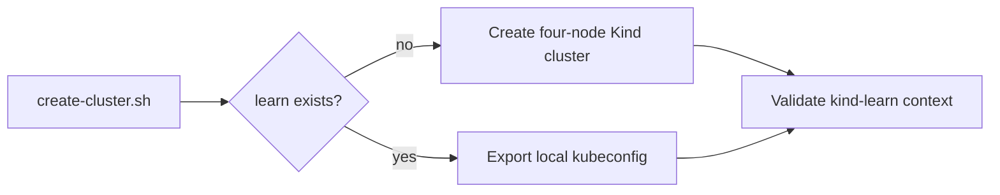

# Kind Cluster Bootstrap Record

## Goal
Provide the smallest repeatable MiniShop foundation: create or reconnect to the
local `kind-learn` cluster with a pinned Kind topology and a repository-local
kubeconfig.

## Prerequisites
- [Issue #8](https://github.com/thanhdu-hcmus/minishop-k8s/issues/8).
- Docker Desktop with WSL integration, Kind, and kubectl already available.

## Key Concepts
| Concept | Plain-language explanation |
|---|---|
| Pinned topology | The Kind node image is fixed by version and digest. |
| Repository-local kubeconfig | Cluster access uses `./.kube/config`, which Git ignores. |

## Architecture / Flow


## Implementation Walkthrough
1. **Declare the cluster**: add a pinned `learn` topology with one control
   plane, three workers, and TCP host mappings for ports 80 and 443.
   - File(s): `cluster/kind-config.yaml`
2. **Bootstrap or reconnect safely**: check Docker, Kind, and kubectl; create
   the cluster when absent, otherwise export its kubeconfig; then require the
   `kind-learn` context.
   - File(s): `scripts/create-cluster.sh`, `scripts/lib.sh`
3. **Keep local state untracked**: ignore the repository-local kubeconfig and
   local tool/browser state.
   - File(s): `.gitignore`

## Run & Verify
```bash
bash -n scripts/lib.sh scripts/create-cluster.sh
KUBECONFIG=./.kube/config kubectl --context kind-learn get nodes --no-headers
```

Observed result: Bash parsing passed. The `kind-learn` control plane and all
three workers reported `Ready`. The existing cluster was not recreated: the
script's existing-cluster path only exports the local kubeconfig.

GitHub Actions run
[36257913264](https://github.com/thanhdu-hcmus/minishop-k8s/actions/runs/36257913264)
passed Conventional Commit validation, YAML linting, the manifest gate, and the
changed-shell ShellCheck gate. It failed only at the T1 devlog gate because this
record did not yet exist.

## Common Pitfalls
- **Symptom**: a local cluster already exists. The bootstrap script exports its
  kubeconfig instead of recreating or reconfiguring the cluster.
- **Symptom**: ShellCheck cannot resolve the helper source. Use the
  repository-relative source directive in `scripts/create-cluster.sh`.

## Try It Yourself
- Run `scripts/create-cluster.sh` once with no `learn` cluster, then again
  after it exists. The second run should reconnect through `kind-learn`.

## Further Reading
- [Git workflow](../process/git-workflow.md)
- [Issue #8](https://github.com/thanhdu-hcmus/minishop-k8s/issues/8)

## Related Docs
- Previous: [Process-controls remediation record](2026-09-26-process-controls-remediation.md)
- Next: Runtime-data slice documentation.

## Implemented
- A pinned four-node Kind topology, idempotent bootstrap/reconnect scripts, and
  ignored repository-local kubeconfig state.

## Decisions
- Keep bootstrap limited to cluster creation and context verification; runtime
  data, workloads, networking, RBAC, scaling, and observability remain outside
  this T1 slice.

## Problems encountered
### Strict commit policy
- **Symptom:** Draft PR #9 was superseded.
- **Root cause:** Its remote commit titles did not meet the strict commit policy.
- **Tried:** Used the first Draft PR to exercise the policy.
- **Fix:** Opened clean-history Draft PR #10 with conforming commit titles.
- **Verified by:** Run 36257913264 reached the T1 devlog gate.
- **Promoted to troubleshooting/AGENTS.md?** no

### Dynamic ShellCheck source
- **Symptom:** ShellCheck could not resolve the dynamically sourced helper.
- **Root cause:** The helper path is computed from the script directory.
- **Tried:** Ran ShellCheck against the changed script.
- **Fix:** Added a repository-relative ShellCheck source directive.
- **Verified by:** Run 36257913264 passed the changed-shell ShellCheck gate.
- **Promoted to troubleshooting/AGENTS.md?** no

## Verification evidence
```bash
# bash -n scripts/lib.sh scripts/create-cluster.sh passed.
# kind-learn control plane and three workers reported Ready.
# CI run 36257913264 passed commitlint, YAML, manifest, and ShellCheck gates;
# it failed only because this T1 devlog had not been added yet.
```

## Follow-ups
- Confirm that the next CI run is green with this devlog present.
- Keep PR #10 as a Draft for owner review; agents do not merge it.
