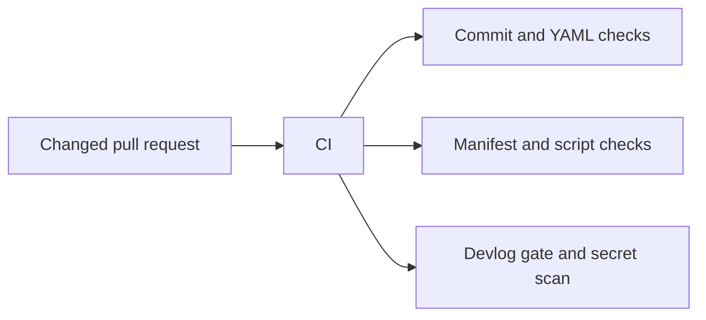

# Process-Controls Remediation Record

## Goal
Close the gaps found in the independent T2 audit of the merged process scaffold, so later MiniShop slices receive the intended CI controls.

## Prerequisites
- [Issue #3](https://github.com/thanhdu-hcmus/minishop-k8s/issues/3).
- The merged process scaffold from [PR #2](https://github.com/thanhdu-hcmus/minishop-k8s/pull/2).

## Key Concepts
| Concept | Plain-language explanation |
|---|---|
| Exact label match | Only a label named exactly `trivial` may bypass the devlog gate. |
| Path-scoped linting | A check runs only when its relevant manifest or script files changed. |

## Architecture / Flow
The remediation extends the existing CI job with controls for commit format, manifest validation, scripts, and the devlog gate.



## Implementation Walkthrough
1. **Tighten process controls**: require a commit scope, lower-case summary, and no trailing period; match the `trivial` label through JSON parsing; and add path-scoped kubeconform, shellcheck, and PSScriptAnalyzer checks.
   - File(s): `.commitlintrc.json`, `.github/workflows/ci.yml`
   - Kubeconform is pinned to `v0.6.7`; PSScriptAnalyzer is pinned to `1.24.0`.
2. **Complete ownership coverage**: assign process-control files and agent instructions to the repository owner.
   - File(s): `.github/CODEOWNERS`
3. **Preserve audit evidence**: record the remediation and link the retrospective scaffold review.
   - File(s): this page, [process scaffold record](2026-09-25-process-scaffold.md)

## Run & Verify
```bash
# GitHub Actions runs the authoritative full workflow on PR #6.
```
Expected result: the `ci` check succeeds. When no matching target paths changed, the manifest and script steps exit before invoking their external linters.

DevOps validation passed: PyYAML, `bash -n` for each run script, the 80-column check, and selector tests. PowerShell was unavailable locally. GitHub Actions run `36255297615` completed the full `ci` job successfully. This control-only PR changed no manifest or script target files, so the manifest and script steps exited early and did not exercise kubeconform, shellcheck, or PSScriptAnalyzer.

## Common Pitfalls
- **Symptom**: a label containing the word `trivial` bypasses the devlog rule. Cause: substring matching. Fix: parse labels as JSON and require an exact `trivial` value.
- **Symptom**: a hosted runner cannot find `rg`. Cause: ripgrep is not guaranteed on the runner image. Fix: use portable `grep -E` in the workflow.

## Try It Yourself
- Open a non-trivial change without a devlog and confirm CI rejects it; add a label other than exactly `trivial` and confirm it remains rejected.

## Further Reading
- [Git workflow](../process/git-workflow.md)
- [Issue #3](https://github.com/thanhdu-hcmus/minishop-k8s/issues/3)

## Related Docs
- Previous: [Process scaffold record](2026-09-25-process-scaffold.md)
- Next: [CI troubleshooting](../troubleshooting.md)

## Implemented
- Exact `trivial` label matching, scoped manifest and script checks, stricter commitlint rules, and expanded CODEOWNERS coverage.

## Decisions
- Remediate the merged scaffold in a focused follow-up rather than rewrite its history → [ADR 0002](../decisions/0002-process-controls-remediation.md).

## Problems encountered
### Commitlint rule exercise
- **Symptom:** Exploratory PR #4 was rejected for an uppercase `CI` commit scope.
- **Root cause:** The remediation intentionally requires lower-case Conventional Commit scopes.
- **Tried:** Used the exploratory commit to confirm the new rule.
- **Fix:** Used a conforming lower-case scope in the final remediation commit.
- **Verified by:** DevOps reports the final non-document validation passed.
- **Promoted to troubleshooting/AGENTS.md?** yes/troubleshooting; no/AGENTS.md

### Hosted-runner ripgrep assumption
- **Symptom:** Exploratory PR #5 reached the workflow checks but could not rely on `rg` being present on the hosted runner.
- **Root cause:** `rg` is not a guaranteed GitHub-hosted runner dependency.
- **Tried:** The first workflow version used `rg` for changed-path filtering.
- **Fix:** Replaced it with portable `grep -E`.
- **Verified by:** The final PR branch contains `grep -E`; GitHub Actions run `36255297615` completed successfully.
- **Promoted to troubleshooting/AGENTS.md?** yes/troubleshooting; no/AGENTS.md

## Verification evidence
```bash
# Six branch runs failed before the final repair: 36254259720, 36254477858,
# 36254526780, 36254551299, 36254565578, and 36254827482.
# DevOps validation: PyYAML, bash -n for each run script, 80-column check,
# and selector tests passed; pwsh was unavailable locally.
# GitHub Actions: run 36255297615 completed ci successfully. No manifest or
# script target paths changed, so their external linters were not exercised.
```

## Follow-ups
- [Issue #3](https://github.com/thanhdu-hcmus/minishop-k8s/issues/3)
- The owner must complete review before marking PR #6 ready or merging it.