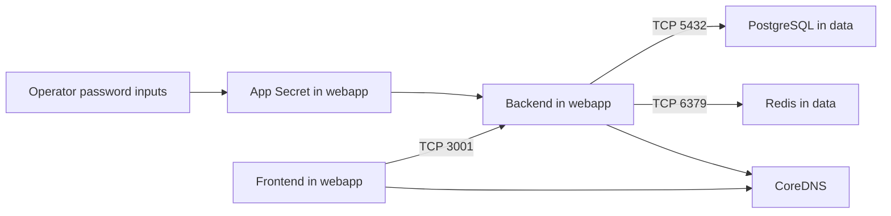

# Application Network Boundary Record

## Goal
Run the MiniShop frontend and backend in `webapp`, connect the backend to the
existing PostgreSQL and Redis services, and describe the intended internal
network boundary without exposing runtime credentials.

## Prerequisites
- [Issue #20](https://github.com/thanhdu-hcmus/minishop-k8s/issues/20).
- The `data` namespace services from the
  [runtime data foundation](../decisions/0004-runtime-data-foundation.md).
- The backend image from the
  [backend image publishing decision](../decisions/0005-backend-image-publishing.md).
- The local Kind cluster and both runtime password inputs available in the
  shell environment. Do not print or commit those values.

## Key Concepts
| Concept | Plain-language explanation |
|---|---|
| Immutable image digest | A content-addressed image reference that identifies the exact deployed image. |
| Namespace-local Secret | A Kubernetes Secret that workloads in its namespace can reference; a Secret in `data` is not directly referenceable by a Pod in `webapp`. |
| Default-deny policy | A NetworkPolicy that selects application Pods and blocks unspecified ingress and egress when the CNI enforces policy. |

## Architecture / Flow


## Implementation Walkthrough
1. **Pin and run the app workloads**: add frontend and backend Services and
   single-replica Deployments in `manifests/20-webapp/`. Both images are
   digest-pinned; the frontend source revision and backend image provenance are
   recorded alongside their manifests and upstream documentation.
2. **Harden workload execution**: set resource requests/limits, HTTP liveness
   and readiness probes, non-root user/group, RuntimeDefault seccomp, dropped
   capabilities, no privilege escalation, read-only root filesystems, and no
   service-account token automount.
3. **Create credentials in the app namespace**: `scripts/create-app-credentials.sh`
   takes `MINISHOP_POSTGRES_PASSWORD` and `MINISHOP_REDIS_PASSWORD` from the
   operator's environment and creates `minishop-app-credentials` in `webapp`.
   It does not copy or read the Secret in `data`.
4. **Define internal paths**: `manifests/20-webapp/networkpolicy.yaml` adds
   default-deny plus frontend-to-backend, backend-from-frontend,
   backend-to-PostgreSQL/Redis, and DNS rules.
5. **Deploy and exercise the path**: `scripts/deploy-app.sh` checks the data
   Secret and service rollouts, then applies the namespace and app resources;
   `scripts/validate-app.sh` checks manifest dry-run, readiness, and a request
   path that writes and reads application data.

### Local deployment
Run these commands from the repository root after loading the two values into
the current shell (for example, from an ignored local `.env`; never display or
commit it):

```bash
set -a
source .env
set +a
kubectl --context kind-learn apply -f manifests/20-webapp/namespace.yaml
./scripts/create-app-credentials.sh
./scripts/deploy-app.sh
./scripts/validate-app.sh
```

The namespace apply is needed before the credential script can create a Secret
there. The credential script fails if either input is unset. The scripts use
the repository's configured `./.kube/config` and `kind-learn` context.

## Decisions
The T2 design is recorded in
[Application workload and network boundary](../decisions/0006-application-network-boundary.md).

## Problems encountered
### Local CNI did not enforce NetworkPolicy
- **Symptom:** A clean denied-path probe still reached the backend after
  applying the NetworkPolicies.
- **Root cause:** The active Kind `kindnet` CNI does not enforce NetworkPolicy.
- **Fix:** Record the cluster limitation and distinguish policy-object
  admission from actual enforcement; no CNI replacement was made in this slice.
- **Verified by:** The denied-path probe reached the backend; no enforcement
  claim is made for this local cluster.

## Verification Evidence
- `bash -n`, ShellCheck 0.10.0, kubeconform 0.6.7 (8/8 resources), and
  yamllint 1.35.1 passed.
- Kubernetes server-side dry-run admitted all eight application resources.
- The backend image started as a non-root user with a read-only root
  filesystem; both app rollouts reached 1/1 Ready.
- `scripts/validate-app.sh` completed its frontend-to-backend-to-data write/read
  check without printing credential values.
- A clean denied-path probe reached the backend under `kindnet`; actual
  NetworkPolicy enforcement is not verified on this cluster.

## Follow-ups
- Validate denied traffic on a CNI that enforces Kubernetes NetworkPolicies
  before claiming that the deny rules are effective at runtime.
- The next packaging or ingress work is outside Issue #20 and is not recorded
  here.

## Related Docs
- [Application network boundary decision](../decisions/0006-application-network-boundary.md)
- [Runtime data foundation record](2026-09-27-runtime-data-foundation.md)
- [Backend image record](2026-09-27-backend-image.md)
- [Issue #20](https://github.com/thanhdu-hcmus/minishop-k8s/issues/20)
