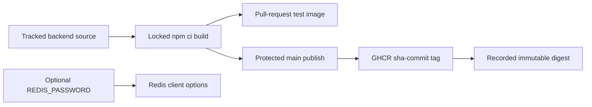

# Redis-Authenticated Backend Image Record

## Goal
Create a reproducible MiniShop backend image that can authenticate to the
password-protected Redis service introduced by the runtime-data foundation,
without breaking no-password Redis deployments.

## Prerequisites
- [Issue #21](https://github.com/thanhdu-hcmus/minishop-k8s/issues/21).
- The runtime data contract recorded in
  [Runtime data foundation](../decisions/0004-runtime-data-foundation.md).
- GHCR package permission for a protected-main publication.

## Key Concepts
| Concept | Plain-language explanation |
|---|---|
| Source-derived image | A container image built from tracked application source instead of copying a prebuilt vendor image. |
| Discovery tag | The `sha-<commit>` GHCR tag that identifies a build; consumers should deploy the immutable digest it records. |
| Optional authentication | A Redis password is sent only when a non-empty runtime setting is supplied. |

## Architecture / Flow

## Implementation Walkthrough
1. **Record the upstream source**: derive the backend from
   `kumahq/kuma-demo` commit
   `db9e13301b4936fd9aa47521db79cc6b7ee8e169` under Apache-2.0 and preserve
   its provenance in `images/backend/UPSTREAM.md`.
2. **Add optional Redis authentication**: configure the maintained Redis v6
   client with `REDIS_PASSWORD` only when it is non-empty, retaining
   no-password compatibility.
3. **Build reproducibly**: use the repository lockfile with `npm ci` and
   digest-pinned Node base images for test and runtime stages.
4. **Publish with scoped permissions**: validate images on pull requests;
   after a protected `main` push, publish one GHCR `sha-<commit>` tag and
   write its digest to the workflow summary. Only that publish job can write
   packages.

## Decisions
The T2 decision is recorded in
[Source-derived backend image publishing](../decisions/0005-backend-image-publishing.md).

## Problems encountered
### Upstream Redis dependency mismatch
- **Symptom:** The upstream package manifest and lockfile specified different
  Redis major versions.
- **Root cause:** The upstream dependency metadata was not internally
  consistent for a reproducible lockfile build.
- **Fix:** Use the maintained Redis v6 client API and an exact lockfile for
  `npm ci`.
- **Verified by:** Backend tests and the dependency audit completed with zero
  known vulnerabilities.

### Initial workflow lint failure
- **Symptom:** The first Draft PR workflow had one line over the repository
  lint limit.
- **Root cause:** The workflow line length exceeded the configured policy.
- **Fix:** Correct the workflow line and revalidated YAML and whitespace checks.
- **Verified by:** Workflow lint, YAML parse, and whitespace checks passed.

### Commit subject policy failure
- **Symptom:** PR #23 CI failed commitlint because a documentation commit subject used the uppercase acronym `GHCR`.
- **Root cause:** Repository commitlint rules require a lowercase subject.
- **Fix:** Recreated the final tree on a clean branch with a lowercase Conventional Commit subject, without rewriting shared history.
- **Verified by:** PR #24 starts from `main` with a valid lowercase commit subject; its CI checks are pending.

## Verification Evidence
- `npm ci --ignore-scripts` completed against the tracked lockfile.
- `npm test` passed, including both optional Redis-password cases.
- `npm audit --omit=dev --audit-level=low` reported zero known
  vulnerabilities.
- Docker test and runtime image targets built successfully.
- Actionlint, YAML parsing, and whitespace checks passed.
- The PR workflow's `validate` job passed. Its `publish` job was skipped
  on the pull request by design.
- At this documentation handoff, the repository `ci` check had failed
  because the required T2 devlog was not yet present.

## Follow-ups
- After the PR merges, protected `main` publishes the first GHCR image and
  records its immutable digest. Verify package visibility and inherited
  repository permissions; intervene in package settings only if they do not
  inherit as intended.
- Deploy the published digest in the separate application and network slice.
- Do not treat the GHCR discovery tag as a deployment pin.

## Related Docs
- Previous: [Runtime data foundation record](2026-09-27-runtime-data-foundation.md)
- Next: application deployment and network integration are not recorded yet.
