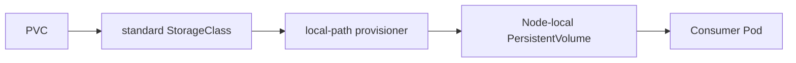

# Local Storage Foundation Record

## Goal
Add dynamic, node-local persistent-volume provisioning for the local Kind
cluster, with a deterministic default storage class.

## Prerequisites
- [Issue #15](https://github.com/thanhdu-hcmus/minishop-k8s/issues/15).
- The repository-local `kind-learn` cluster configuration.

## Key Concepts
| Concept | Plain-language explanation |
|---|---|
| Local-path provisioner | A controller that creates local persistent volumes for PVCs. |
| Default StorageClass | The class Kubernetes selects when a PVC does not name one. |
| WaitForFirstConsumer | Delay provisioning until a Pod that uses the PVC can be scheduled. |

## Architecture / Flow

## Implementation Walkthrough
1. **Install the provisioner manifest**: add the `local-path-storage`
   namespace, service account, RBAC bindings, deployment, configuration, and
   `local-path` storage class from Rancher local-path provisioner release
   `v0.0.32`.
   - File(s): `manifests/00-storage/local-path-provisioner.yaml`
2. **Bound the controller dependencies**: pin the controller to
   `rancher/local-path-provisioner:v0.0.32`, pin the helper image to
   `busybox:1.36.1`, and define controller CPU and memory requests and limits.
   - File(s): `manifests/00-storage/local-path-provisioner.yaml`
3. **Choose one default**: define `standard` as the only default class while
   retaining `local-path` as non-default. Both use the local-path provisioner,
   `WaitForFirstConsumer`, and the `Delete` reclaim policy.
   - File(s): `manifests/00-storage/standard-storageclass.yaml`

## Decisions
The T2 storage decision is recorded in
[Local storage foundation](../decisions/0003-local-storage-foundation.md).

## Problems encountered
### Host YAML linter unavailable
- **Symptom:** `yamllint` was absent from the WSL `PATH`.
- **Root cause:** Not recorded.
- **Fix:** Used the pinned containerized linter; no host tool was installed.
- **Verified by:** YAML lint passed.

### Initial container tag unavailable
- **Symptom:** `cytopia/yamllint:1.35` could not be pulled.
- **Root cause:** That image tag did not exist.
- **Fix:** Validation used `cytopia/yamllint:1-0.13`.
- **Verified by:** YAML lint passed.

### No provisioner health endpoint
- **Symptom:** No documented HTTP or TCP health endpoint was available for the
  provisioner.
- **Root cause:** Not recorded.
- **Fix:** Used Kubernetes rollout availability and restart behavior rather
  than an unsupported probe.
- **Verified by:** The provisioner rollout completed.

## Verification evidence
- `git diff --check` passed.
- Pinned `yamllint` passed.
- Kubernetes client dry-run accepted all 10 resources.
- Kubeconform validated all 10 resources.
- The local-path-provisioner rollout completed.
- An isolated PVC-and-Pod mount test completed successfully.
- The temporary `minishop-storage-e2e-15` namespace was deleted; the final
  namespace check was empty.

## Follow-ups
- Add application workloads that exercise persistent storage in a subsequent
  Issue.
- Treat this storage as node-local: the `Delete` reclaim policy and one
  provisioner replica are deliberate limits of this local learning setup.
- No upstream health endpoint was included in this slice.

## Related Docs
- [Local storage foundation decision](../decisions/0003-local-storage-foundation.md)
- [Kind cluster bootstrap record](2026-09-26-kind-cluster-bootstrap.md)
- [Issue #15](https://github.com/thanhdu-hcmus/minishop-k8s/issues/15)
- [PR #16](https://github.com/thanhdu-hcmus/minishop-k8s/pull/16)
