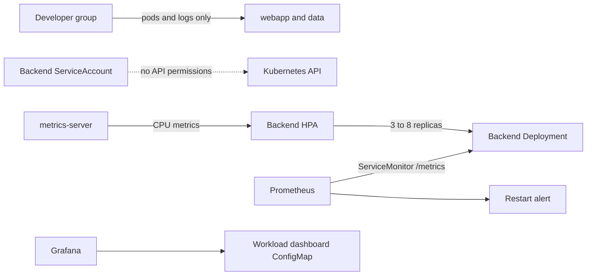

# RBAC, Autoscaling, and Observability Record

## Goal
Add least-privilege RBAC, metrics-backed scaling for the MiniShop backend, and
cluster/workload observability to the existing local Kind runtime.

## Prerequisites
- [Issue #26](https://github.com/thanhdu-hcmus/minishop-k8s/issues/26).
- The `kind-learn` cluster, existing `webapp` application, and
  `minishop-app-credentials` Secret.
- `kubectl` and Helm for the complete `scripts/deploy-platform.sh` workflow.

## Key Concepts
| Concept | Plain-language explanation |
|---|---|
| ServiceAccount | Workload identity; this backend's dedicated account has no Kubernetes API permissions. |
| HorizontalPodAutoscaler (HPA) | Adjusts Deployment replicas from resource metrics within configured bounds. |
| ServiceMonitor | Prometheus Operator resource that discovers and scrapes a labeled Service endpoint. |
| kindnet limitation | The local cluster accepts NetworkPolicy objects but does not enforce them. |

## Architecture / Flow

## Implementation Walkthrough
1. **Define RBAC**: `manifests/30-platform/rbac.yaml` adds a backend ServiceAccount
   with token automount disabled and a developer group role limited to pod and
   pod-log access, bound in `webapp` and `data`.
2. **Provide resource metrics and scaling**: `scripts/deploy-platform.sh` applies
   pinned metrics-server `v0.7.2`, adds the Kind-required kubelet TLS flag when
   absent, and bounds its resources. The HPA in
   `manifests/30-platform/autoscaling.yaml` targets CPU utilization of 50%, with
   3–8 replicas and scale behavior limits.
3. **Add monitoring**: deploy the pinned kube-prometheus-stack chart `69.8.2`
   with local resource settings, then apply
   `manifests/30-platform/monitoring.yaml` for the workload dashboard, backend
   ServiceMonitor, and restart alert.
4. **Integrate safely with the existing backend**: the backend Service and
   Deployment use a disjoint selector (`component=minishop-backend`) so the new
   HPA does not overlap the legacy workload selector. The update also keeps the
   corresponding NetworkPolicy and monitoring selectors aligned.
5. **Validate behavior**: `scripts/validate-platform.sh` checks RBAC allow/deny,
   metrics availability, HPA scale up/down, backend scraping, and the restart
   alert; its temporary load Job and NetworkPolicies are cleaned up.

## Decisions
The T2 platform decision is recorded in
[RBAC, autoscaling, and observability](../decisions/0007-platform-observability.md).

## Problems encountered
### Local Kubernetes client initially could not reach the API
- **Symptom:** `kubectl` in the isolated worktree failed to connect to the
  `kind-learn` API at `127.0.0.1:34077` with `socket: operation not permitted`.
- **Cause:** The command sandbox blocked the local API socket.
- **What was tried:** Read-only cluster inspection through Kubernetes MCP
  confirmed the cluster state, but did not provide the required local
  `kubectl auth can-i` verification.
- **Fix:** Retried the single read-only authorization check using the existing
  owner-approved localhost permission.
- **Verification:** Escalated `kubectl auth can-i get pods -n webapp` returned
  `yes` for the current operator identity; the check ran from the isolated
  worktree and did not read Secret values.

### Existing backend HPAs had overlapping selectors
- **Symptom:** Both the new `minishop-backend` HPA and the pre-existing
  `backend` HPA reported `AmbiguousSelector` and did not calculate metrics.
- **Cause:** The legacy `backend` Deployment and the Issue #20
  `minishop-backend` Deployment both selected
  `app.kubernetes.io/component=backend,app.kubernetes.io/name=minishop`.
- **What was tried:** The new HPA was first applied using distinct resource
  names, but its target pods still matched the legacy HPA's broad selector.
- **Fix:** Keep the legacy HPA untouched and give only the new backend
  Deployment a disjoint component selector, updating its dependent Service,
  NetworkPolicy, and ServiceMonitor selectors. The selector is immutable, so
  replace only `deployment/minishop-backend` during the approved runtime test.
- **Verification:** The new HPA now reports CPU `2%/50%` with three desired
  replicas; the legacy HPA continues to target only its original Deployment.
- **Limit:** Kubernetes events from before the selector change remain in the
  event history; they do not indicate a current overlap.

### Kind container runtime briefly failed to create replacement Pods
- **Symptom:** During the approved backend selector recreation, new Pods
  remained in `ContainerCreating` and rollout waited; events reported
  containerd socket connection resets/refusals.
- **Cause:** The Kind node's containerd connection was intermittently
  unavailable. Similar sandbox errors were already present on the existing
  scheduled-report Jobs before this change; this was not caused by credentials
  or the new image.
- **What was tried:** Confirmed the new backend image was already present on
  nodes and checked the new HPA's current CPU metric; it now reports
  `2%/50%` without an active selector conflict.
- **Fix:** Allow the node runtime to recover before retrying the rollout; no
  unrelated Job or legacy workload was modified.
- **Verification:** All three replacement backend replicas reached Ready
  after the Kind node's containerd sandbox-name reservation cleared.

### ServiceMonitor initially did not discover the backend Service
- **Symptom:** Prometheus API returned no active target for the new ServiceMonitor.
- **Cause:** ServiceMonitor label selectors match Service metadata labels; the
  MiniShop Service had only a pod selector and no application metadata labels.
- **What was tried:** Confirmed the Prometheus release selector, namespace
  selector, ServiceMonitor selector, endpoint name, and backend endpoints.
- **Fix:** Add the same disjoint backend app labels to Service metadata.
- **Verified by:** Prometheus query returned `up=1` for each Ready
  `minishop-backend` endpoint at `/metrics` on Service port `http` (port
  3001, targeting container port 3001). The backend exposes Prometheus
  `http_request_duration_seconds` metrics, so no app-metrics gap remains.

### Docker socket access was denied by the default sandbox
- **Symptom:** Pinned container-based validation initially failed to connect
  to `/var/run/docker.sock` with `operation not permitted`.
- **Cause:** The command sandbox blocked Docker daemon access.
- **What was tried:** Host validators were not installed; I used the approved
  pinned validation images after checking with the owner.
- **Fix:** Use the owner's existing Docker authorization for read-only lint,
  schema, and chart-render checks.
- **Verification:** ShellCheck 0.10.0, yamllint 1.35.1, kubeconform 0.6.7,
  and Helm 3.17.3 all ran in containers.

### Runtime validator initially queried the restart alert too early
- **Symptom:** The first full validation reported no firing backend-restart alert
  immediately after it observed the controlled container restart.
- **Cause:** Prometheus evaluates alert rules on an interval, so the restart
  counter update was not guaranteed to appear in `ALERTS` before the immediate
  query. The alert rule was loaded and later reported firing for the expected
  backend Pod.
- **What was tried:** Queried Prometheus's rule and restart metric APIs without
  reading credentials; the expected rule was firing with a positive restart
  increase.
- **Fix:** Make the runtime validator poll the alert API for up to 90 seconds,
  covering the configured evaluation interval.
- **Verification:** Full runtime validation passed RBAC allow/deny checks,
  metrics-server metrics, HPA scale-up from 3 to 8 and scale-down to 3, healthy
  backend scraping, and the controlled restart alert. Temporary load Job and
  NetworkPolicies were removed by the validator.

## Validation
- Pinned ShellCheck 0.10.0 passed on both changed shell scripts.
- Pinned yamllint 1.35.1 passed on all changed YAML files.
- Pinned kubeconform 0.6.7 reported 14 valid resources, zero invalid/errors,
  and two skipped custom Prometheus Operator schemas.
- Server-side dry-run and full runtime validation passed. Helm chart version
  69.8.2 was rendered and updated in place with preserved release values; the
  existing metrics-server release v0.7.2 was reused without uninstalling it.
- Metrics-server uses one replica with 100m/200Mi requests and 250m/256Mi
  limits; rollout and `kubectl top nodes` passed after applying these bounds.
- The Kind cluster's `kindnet` CNI does not enforce NetworkPolicies; policy
  objects are installed narrowly, but enforcement is not claimed or runtime
  tested in this cluster.
- The complete `scripts/deploy-platform.sh` was not invoked directly because
  Helm was unavailable on the host. Its platform actions were exercised using
  a pinned Helm container, preserving the existing chart release with
  `--reuse-values`; this does not constitute an end-to-end test of that script.

## Follow-ups
- Run `scripts/deploy-platform.sh` directly on a host with Helm installed, or
  document a supported containerized invocation, to verify the full deploy
  script end to end.
- Test NetworkPolicy enforcement on a CNI that implements it before claiming
  runtime deny behavior.
- The new Grafana dashboard ConfigMap is provided; a separate browser/UI
  acceptance check is not recorded.

## Related Docs
- [Platform observability decision](../decisions/0007-platform-observability.md)
- [Troubleshooting](../troubleshooting.md)
- [Issue #26](https://github.com/thanhdu-hcmus/minishop-k8s/issues/26)
