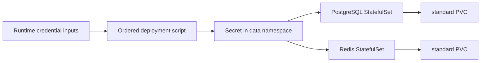

# Runtime Data Foundation Record

## Goal
Provide persistent, internal PostgreSQL and Redis runtime dependencies for
later MiniShop workloads without committing runtime credentials.

## Prerequisites
- [Issue #17](https://github.com/thanhdu-hcmus/minishop-k8s/issues/17).
- The `standard` StorageClass from the local storage foundation.
- Runtime values for both required credential environment variables.

## Key Concepts
| Concept | Plain-language explanation |
|---|---|
| StatefulSet | A workload controller that provides a stable Pod identity and its own persistent-volume claim. |
| Headless Service | A governing Service that lets a StatefulSet provide stable DNS identity. |
| AOF | Redis append-only persistence, used here to retain writes across a controlled restart. |

## Architecture / Flow

## Implementation Walkthrough
1. **Create the runtime boundary**: add the `data` namespace and internal-only
   stable and governing headless Services for PostgreSQL and Redis.
   - File(s): `manifests/10-data/namespace.yaml`,
     `manifests/10-data/postgresql.yaml`, `manifests/10-data/redis.yaml`
2. **Persist each dependency**: configure one StatefulSet per dependency with
   a `standard` PVC template, pinned image digest, probes, resource bounds, and
   restricted Pod and container security settings.
   - File(s): `manifests/10-data/postgresql.yaml`,
     `manifests/10-data/redis.yaml`
3. **Create credentials before workloads**: `scripts/deploy-data.sh` requires
   both runtime inputs, applies the namespace, invokes
   `scripts/create-data-credentials.sh`, then applies PostgreSQL and Redis.
   It stops before any Kubernetes operation when an input is missing, and
   stops before workload application when credential creation fails.
   - File(s): `scripts/deploy-data.sh`,
     `scripts/create-data-credentials.sh`

## Decisions
The T2 design decision is recorded in
[Runtime data foundation](../decisions/0004-runtime-data-foundation.md).

## Problems encountered
### Dynamic helper source in ShellCheck
- **Symptom:** CI ShellCheck reported `SC1091` for scripts that source a
  dynamically resolved shared helper.
- **Root cause:** The CI invocation does not follow dynamic helper paths.
- **Fix:** The clean feature commit `0737de3` includes the script-local
  ShellCheck suppression.
- **Verified by:** Both scripts were source-checked locally; CI runs its
  changed-shell gate.

### Transient local-path helper disruption
- **Symptom:** `learn-worker2` transiently reset its containerd socket while
  the Redis local-path helper was creating its PVC.
- **Root cause:** Not recorded.
- **Fix:** The provisioner retry bound the PVC successfully; no node or
  cluster-wide mutation was made.
- **Verified by:** Redis reached readiness and its PVC bound through `standard`.

## Verification evidence
- Kubernetes client dry-run accepted the namespace, PostgreSQL, and Redis
  manifests.
- Bash parsing and ShellCheck passed for the credential and ordered deployment
  scripts.
- Calling the ordered deployment script without both required inputs exited
  nonzero before any Kubernetes operation.
- The ordered entry point created credentials before applying workloads. Both
  PVCs bound through `standard`; both Pods became Ready; authenticated
  PostgreSQL and Redis checks passed without exposing values.
- Controlled Pod restarts retained validation data for PostgreSQL and Redis.
  The temporary validation records were then removed.
- CI manifest/schema and ShellCheck gates pass. At documentation handoff, the
  reported remaining CI failure was the required devlog gate.

## Follow-ups
- Add application workloads and their integration with these internal services
  in later slices.
- Add TLS, NetworkPolicies, backup/restore, and a highly available topology
  separately; none is provided by this single-replica, local-path foundation.

## Related Docs
- [Runtime data foundation decision](../decisions/0004-runtime-data-foundation.md)
- [Local storage foundation record](2026-09-27-local-storage-foundation.md)
- [Issue #17](https://github.com/thanhdu-hcmus/minishop-k8s/issues/17)
- [PR #19](https://github.com/thanhdu-hcmus/minishop-k8s/pull/19)
