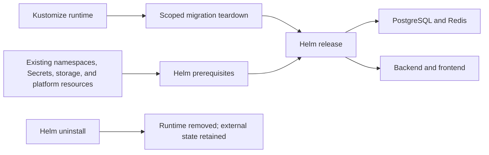

# Helm Packaging Implementation Record

## Goal
Package the MiniShop PostgreSQL, Redis, backend, and frontend runtime as a Helm
chart, with controlled Kustomize migration and teardown paths that preserve
stateful data and external platform resources.

## Prerequisites
- [Issue #30](https://github.com/thanhdu-hcmus/minishop-k8s/issues/30).
- Existing `data` and `webapp` namespaces, credential Secret objects, and
  `minishop-backend` ServiceAccount.
- The existing `standard` StorageClass and platform HPA, RBAC, and monitoring
  resources.
- Docker and kubectl. Helm CLI `3.17.3` is pinned and run in the
  `alpine/helm:3.17.3` container.

## Key Concepts
| Concept | Plain-language explanation |
|---|---|
| Helm chart | A versioned package of Kubernetes templates and values managed as a named release. |
| Values file | Environment-specific input for chart settings such as replica counts. |
| Release boundary | Chart resources; credentials, storage, and platform services stay external. |

## Architecture / Flow

## Implementation Walkthrough
1. **Template the runtime**: add chart templates for PostgreSQL and Redis
   Services/StatefulSets, backend and frontend Services/Deployments, and
   application NetworkPolicies. Image references use immutable digests, and
   resource requests/limits remain aligned with canonical manifests.
2. **Define replica values**: keep defaults and add dev 1/1 and prod 3/2 backend
   and frontend replica values. Other configuration remains shared.
3. **Enforce prerequisites and migration scope**: use helper scripts to check
   the existing namespaces, Secret objects, backend ServiceAccount, and HPA;
   migrate from Kustomize by removing only its runtime objects. Helm teardown
   uninstalls the release without targeting persistent claims or external
   platform resources.
4. **Run Helm in a pinned container**: invoke Helm `3.17.3` from
   `alpine/helm:3.17.3`; the host does not require a Helm installation.

## Decisions
The T2 packaging decision is recorded in
[Helm packaging](../decisions/0009-helm-packaging.md).

## Problems encountered
### Transient Kind/containerd sandbox failure
- **Symptom:** A transient Kind/containerd sandbox issue delayed the second
  Helm install; a Helm-owned backend Pod remained Pending and was not running.
- **Root cause:** Not recorded.
- **Resolution:** The workload recovered. The sole Pending, non-running
  Helm-owned backend Pod was deleted, and its controller replacement became
  Ready. No manual node restart was needed.
- **Verified by:** The release completed reinstall and rollout checks, and the
  final Helm release was deployed.

## Verification evidence
- Bash syntax, ShellCheck `0.10.0`, yamllint `1.35.1`, Helm lint/render for
  default/dev/prod, and kubeconform `0.6.7` passed.
- Rendered chart resources matched canonical manifests except for the approved
  replica differences.
- Runtime checks passed the scoped Kustomize-to-Helm handoff, Helm install,
  uninstall, and reinstall; PostgreSQL, Redis, backend, and frontend rollouts;
  and frontend POST/GET end-to-end validation.
- The deployed backend HPA stayed at its minimum of 3 ready replicas. All five
  PVC/PV bindings remained intact.
- Credential Secret objects, namespaces, storage, platform RBAC/HPA/monitoring,
  legacy workloads, and the local-path provisioner were preserved. Secret
  values were not accessed or recorded.
- The transient Kind/containerd sandbox issue delayed reinstall; after workload
  recovery and replacement of one Pending Helm-owned backend Pod, reinstall and
  rollout verification completed. No manual node restart was needed.
- PR and CI status were not recorded in the handoff used for this entry.

## Follow-ups
- Verify NetworkPolicy enforcement on a policy-capable CNI; the tested local
  Kind `kindnet` setup does not enforce it.
- No follow-up Issue was recorded in the handoff.
- PR and CI results: not recorded in the documentation handoff.

## Related Docs
- [Helm packaging decision](../decisions/0009-helm-packaging.md)
- [Kustomize packaging record](2026-09-28-kustomize-packaging.md)
- [Issue #30](https://github.com/thanhdu-hcmus/minishop-k8s/issues/30)
- PR: not recorded
