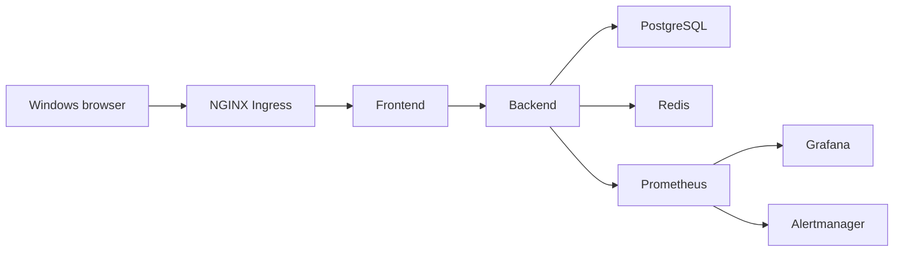

# Run MiniShop on WSL2 Kind

## Goal
Run the MiniShop learning platform on the local four-node `kind-learn` cluster from WSL2. The core application, data services, ingress, scaling, RBAC, MetalLB, and observability have been exercised against that cluster.

## Prerequisites
- WSL2 Ubuntu with Docker Desktop WSL integration, `kind`, `kubectl`, and Bash.
- Helm is required for observability and static chart validation. This run used the repository-local executable in `.tools/bin`; it is ignored by Git.
- Optionally, an exported `POSTGRES_PASSWORD` to choose the initial database password. A local `.env` is optional, is not sourced by the scripts, and must not be committed or printed.
- Windows Administrator access only to add the `minishop.local` hosts entry.

## Key Concepts
| Concept | Plain-language explanation |
|---|---|
| Kind | The local Kubernetes cluster named `learn`; its kubectl context is `kind-learn`. |
| CNPG | The CloudNativePG operator runs the two-instance PostgreSQL cluster. |
| Readiness gate | Backend sidecars remove Pods from Service endpoints while Postgres or Redis is unavailable. |
| HPA | The backend scales from three to eight replicas when average CPU reaches 50 percent. |

## Architecture / Flow
The frontend receives browser traffic through NGINX ingress. It calls the backend, which uses PostgreSQL and Redis in the `data` namespace. Prometheus scrapes backend metrics, Grafana displays CPU, and Alertmanager receives restart alerts.



## Implementation Walkthrough
1. **Provision the local cluster**: `scripts/provision.sh` creates or reuses Kind, configures node labels and the database taint, and installs the required controllers.
   - File(s): `cluster/kind-config.yaml`, `scripts/provision.sh`
   - The cluster uses four nodes and maps ports 80 and 443 from the Kind control plane.
2. **Deploy MiniShop**: `scripts/deploy.sh` applies namespaces, creates runtime configuration only when `postgres-creds` is absent, waits for data dependencies, then deploys workloads and core resources.
   - File(s): `scripts/deploy.sh`, `scripts/create-runtime-config.sh`
   - All Kubernetes access is fixed to `KUBECONFIG=./.kube/config` and context `kind-learn` through `scripts/lib.sh`.
3. **Add observability and local networking**: provision kube-prometheus-stack, apply the monitoring objects, and configure the MetalLB address pool for the Kind Docker network.
   - File(s): `scripts/provision-observability.sh`, `scripts/configure-metallb.sh`, `manifests/09-observability/backend-monitoring.yaml`
   - The Grafana dashboard includes a backend CPU query and the Prometheus rule alerts on backend restarts.

## Run & Verify
If you want to choose the initial password, export `POSTGRES_PASSWORD` before running the deployment. Otherwise leave it unset.

```bash
./scripts/setup.sh
./scripts/provision.sh
./scripts/deploy.sh
./scripts/provision-observability.sh
export METALLB_ADDRESS_POOL=<unused-kind-docker-network-range>
./scripts/configure-metallb.sh
./scripts/validate.sh
```
Leave `POSTGRES_PASSWORD` unset to generate a random value during the first deployment. The scripts do not source `.env`. Expected result: the scripts use `kind-learn`, MiniShop resources become ready, and static Bash, Kustomize, and Helm validation passes. `yamllint` is optional and was unavailable during this run.

From Administrator PowerShell on Windows, map the browser name once:

```powershell
Add-Content -LiteralPath 'C:\Windows\System32\drivers\etc\hosts' -Value '127.0.0.1 minishop.local'
ipconfig /flushdns
curl.exe -I http://minishop.local/
```

Expected result: `HTTP/1.1 200 OK`. This response and the catalog product JSON were verified from Windows.

## Common Pitfalls
- **Symptom**: `minishop.local` cannot be reached from Windows. **Cause and fix**: add the hosts entry in an elevated PowerShell session, flush DNS, and retry.
- **Symptom**: a deployment script targets the wrong cluster. **Cause and fix**: do not override the repository convention; scripts set `KUBECONFIG=./.kube/config` and use context `kind-learn`.
- **Symptom**: backend Pods remain running but disappear from endpoints. **Cause and fix**: restore Redis or PostgreSQL; readiness gates intentionally remove unhealthy dependency paths without restarting the backend.
- **Symptom**: the HPA has no CPU metric. **Cause and fix**: wait for metrics-server and confirm `kubectl top pods -n webapp` returns values before load testing.

## Try It Yourself
- Delete a Redis Pod and a CNPG instance Pod one at a time, wait for recovery, and confirm persisted data remains available.
- Load the backend until HPA reaches eight replicas, then stop load and observe it settle at three replicas.
- Cause one backend restart and confirm `MiniShopBackendRestarting` appears in Alertmanager.

## Further Reading
- [Kind configuration](https://kind.sigs.k8s.io/docs/user/configuration/)
- [CloudNativePG documentation](https://cloudnative-pg.io/documentation/)
- [Kubernetes Horizontal Pod Autoscaling](https://kubernetes.io/docs/tasks/run-application/horizontal-pod-autoscale/)

## Related Docs
- Previous: N/A
- Next: N/A

## Verified Runtime Evidence
- Backend was ready at `3/3`, frontend at `2/2`, CNPG at `2/2`, Redis was ready, and the migration and report CronJobs completed successfully.
- HPA scaled backend from three to eight replicas under load and settled at three replicas after load stopped with 10 percent CPU.
- Redis and PostgreSQL data persisted after their Pods were deleted; backend readiness removed endpoints during a Redis outage without container restarts, and the backend recovered afterward.
- RBAC allowed the documented Pod actions and denied Secret reads; ingress and MetalLB checks passed.
- Prometheus, Grafana, and Alertmanager became ready; the Grafana CPU query returned live data and the backend restart alert reached Alertmanager.
- Playwright opened `http://minishop.local` in Firefox and rendered `Home | Kuma Marketplace` with 100 product images and titles. Searching `Manufact` returned `Manufact Frugal Sun Dress - Size M`, and its `Read Reviews` control opened the matching review dialog. The browser reported no application console errors; Firefox emitted one `.local` bounce-tracker privacy warning.
