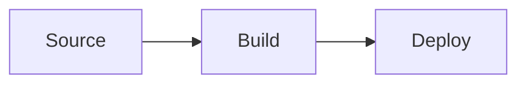

# <Title>

## Goal
One or two sentences: what this builds and why it matters.

## Prerequisites
- Tools and versions (e.g. Docker 27, Terraform 1.9)
- Accounts, credentials or earlier docs to complete first (link them)

## Key Concepts
| Concept | Plain-language explanation |
|---|---|
| <term> | <what it is and why it's used here> |

## Architecture / Flow
A short diagram or description of how the pieces connect.



## Implementation Walkthrough
1. **Step name**: what we did and why.
   - File(s): `path/to/file`
   - Notable lines or settings, explained.
2. **Step name**: ...

## Run & Verify
```bash
# commands to run
```
Expected result: <what success looks like>

## Common Pitfalls
- **Symptom**: cause, then fix.

## Try It Yourself
- Small exercise to extend or break the setup and observe the result.

## Further Reading
- <official doc link>

## Related Docs
- Previous: [<title>](./NN-previous.md)
- Next: [<title>](./NN-next.md)