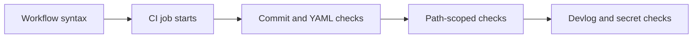

# CI Troubleshooting

## Goal
Provide durable symptom-to-fix guidance for the process-scaffold failures that future MiniShop pull requests could repeat.

## Prerequisites
- Access to the pull request’s `ci` check and its failed-step logs.
- [Git workflow](./process/git-workflow.md) for the expected delivery sequence.

## Key Concepts
| Concept | Plain-language explanation |
|---|---|
| Job creation | A workflow syntax failure can stop GitHub Actions before any job exists. |
| Synthetic merge commit | GitHub can create a temporary merge ref for a PR; commitlint should check the actual branch commits instead. |
| Hosted runner | A runner image is not a contract that every convenience tool is installed. |

## Architecture / Flow
A pull request first loads its workflow, then starts the `ci` job, then runs each validation step.



## Implementation Walkthrough
1. **Record workflow bootstrap failures**: capture the exact failure class before changing CI.
   - File(s): `.github/workflows/ci.yml`
   - A run with no job generally indicates a workflow-loading issue rather than a failed step.
2. **Use portable, pinned checks**: configuration belongs in the repository; runner tools are used only when explicitly available.
   - File(s): `.commitlintrc.json`, `.github/workflows/ci.yml`
   - The remediation pins kubeconform and PSScriptAnalyzer, collects PowerShell findings before failing, and replaces `rg` with `grep -E`.

## Run & Verify
```bash
# Open the failed `ci` run and identify whether a job was created.
# Read the named failed step before changing the workflow.
```
Expected result: the diagnosis identifies the failing layer and the next run advances beyond that layer. The clean-history remediation PR #7 completed successfully in GitHub Actions run `36256218460`; the earlier PR #6 run remains historical troubleshooting evidence.

## Common Pitfalls
- **Symptom:** A workflow run fails before any job begins. **Cause:** workflow YAML or expression syntax is invalid. **Fix:** correct the reported line, then confirm the next run creates `ci`.
- **Symptom:** Commitlint reports `empty-rules`. **Cause:** the CLI has no repository rule configuration. **Fix:** add and version a commitlint configuration, then lint the actual PR commit range.
- **Symptom:** Yamllint reports document-start, truthy-key, or line-length violations. **Cause:** the workflow does not meet the repository’s lint policy. **Fix:** make the YAML conform exactly and rerun the pinned linter.
- **Symptom:** CI cannot find `rg`. **Cause:** ripgrep is not guaranteed on a hosted runner. **Fix:** use `grep -E` for this simple changed-path filter or provision the dependency explicitly.

## Try It Yourself
- Make a temporary Draft PR with a non-trivial change and no devlog; confirm the `ci` job reaches the devlog gate after earlier checks pass.

## Further Reading
- [GitHub Actions workflow syntax](https://docs.github.com/en/actions/reference/workflows-and-actions/workflow-syntax)
- [Commitlint getting started](https://commitlint.js.org/guides/getting-started.html)

## Related Docs
- Previous: [Process-controls remediation record](./devlog/2026-09-26-process-controls-remediation.md)
- Next: N/A
